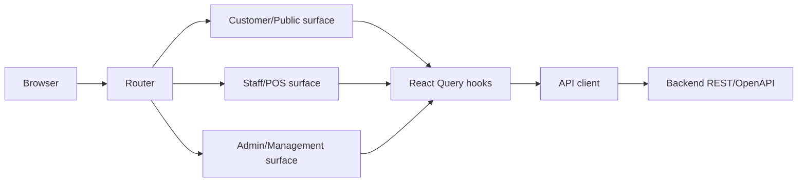

# System Overview

## Architecture

The frontend is a React/Vite modular application. `src/main.tsx` bootstraps providers and the router. `src/routes/router.tsx` composes public, auth, staff and management surfaces. Feature modules own domain pages, hooks and UI; shared components provide cross-feature controls and feedback states.

## Major boundaries

- `src/api`: transport, errors, generated OpenAPI types.
- `src/auth`: session persistence, principal restoration, login/logout and auth context.
- `src/routes`: route guards, workspace policy, navigation policy and lazy route adapters.
- `src/features`: domain-specific pages/components/hooks.
- `src/shared`: reusable UI primitives, formatting and validation helpers.
- `src/layouts`: public, auth, staff and management shells.

## Authorization

Route guards use authenticated principal actor/role and preserve backend authorization semantics. Post-login routing is a UX policy only and cannot grant access.

## State/data flow

Components call feature hooks. Hooks call API modules through the shared API client. React Query owns request lifecycle and cache. Auth session storage owns access token and principal persistence; `/auth/me` revalidates stored sessions.

## External integration

The primary integration is the Backend API described by the sibling OpenAPI snapshot. The frontend also contains VNPay presentation/return handling, but payment authority remains backend state.

## Verification

See `package.json` scripts and `readme.md`. Main gates are typecheck, lint, unit/component test, build, architecture check and E2E when runtime dependencies are available.

## Known limitations

This document describes verified repository structure, not deployment topology or production runtime behavior.
