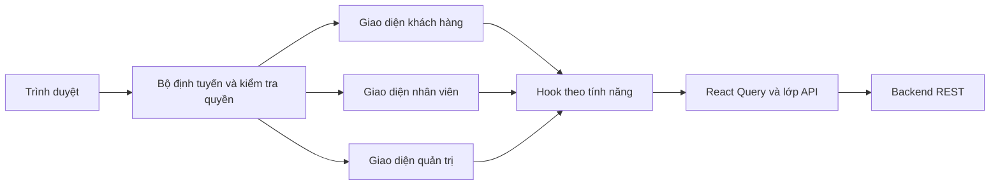

# Kiến trúc và hiện trạng Frontend

Đối chiếu mã nguồn và OpenAPI cục bộ ngày 2026-09-10. Đây là mô tả bản làm việc,
không phải chứng nhận ứng dụng đã chạy đúng trên môi trường triển khai.

## Công nghệ và phân lớp

React 19, Vite 8, TypeScript 6, React Router 7 và Tailwind CSS 4.
TanStack React Query quản lý dữ liệu máy chủ; React Hook Form và Zod xử lý biểu mẫu.
Vitest/Testing Library kiểm thử đơn vị và thành phần; Playwright kiểm thử trình duyệt.
Phiên bản chính xác và lệnh nằm trong [package.json](../../package.json).

| Thư mục | Trách nhiệm |
| --- | --- |
| `src/main.tsx`, `src/app` | Khởi tạo ứng dụng, cấu hình và bộ nhớ đệm truy vấn |
| `src/api` | Gửi HTTP, chuẩn hóa phản hồi/lỗi, kiểu sinh từ OpenAPI |
| `src/auth` | Đăng nhập, lưu/khôi phục phiên, xác minh qua `/auth/me` |
| `src/routes` | Tuyến đường, quyền theo loại tài khoản/vai trò, đích sau đăng nhập |
| `src/layouts` | Khung trang khách hàng, xác thực, nhân viên và quản trị |
| `src/features/<domain>` | Trang, thành phần, API và hook thuộc từng nghiệp vụ |
| `src/shared` | Thành phần dùng chung, định dạng và hỗ trợ kiểm tra dữ liệu |

Các nhóm nghiệp vụ gồm xác thực, đặt phòng, khách hàng, dashboard, trang chủ,
thanh toán, phòng, loại phòng, tiện nghi và nhân viên. Có thư mục không đồng nghĩa
tính năng đang được mở trong bộ định tuyến.

## Đăng nhập và không gian làm việc

| Loại tài khoản | Đích mặc định hiện tại | Phạm vi giao diện |
| --- | --- | --- |
| Khách hàng (`actorType: customer`) | `/` | Trang công khai, hồ sơ và đặt phòng của mình |
| Nhân viên (`STAFF`) | `/staff/counter` | `/staff/*` |
| Quản trị viên (`ADMIN`) | `/management/bookings` | `/management/*`; tuyến nhân viên được chính sách cho phép |

`/login` là trang đăng nhập chung; `/management/login` còn phục vụ tương thích.
Trong `src/auth/api.ts`, Frontend thử `/auth/customers/login` rồi chỉ thử
`/auth/users/login` nếu lần đầu trả `401`. Chưa có `/auth/login` trong đặc tả đang đọc.

`returnTo` phải an toàn, đúng quyền và đúng không gian sau đăng nhập. Quyền mở trang
khác với chính sách chọn trang đích: ADMIN có thể mở tuyến nhân viên được phép nhưng
không lấy đó làm đích đăng nhập. Lớp bảo vệ tuyến đường hỗ trợ giao diện; Backend
vẫn kiểm tra quyền trên từng yêu cầu.

## Những điểm đã thay đổi so với tài liệu cũ

- Dashboard đang tạm ngưng: `management-routes.tsx` không mở tuyến dashboard,
  `MANAGEMENT_PATHS.dashboard` trỏ tới `/management/bookings`; OpenAPI Backend
  hiện không có `/management/dashboard/summary`. Mã dashboard được giữ làm mẫu
  thiết kế và để cân nhắc khôi phục khi Backend hỗ trợ lại.
- Phòng đã có tuyến tạo, sửa, ảnh riêng: `/management/rooms/new`,
  `/management/rooms/:roomId/edit`, `/management/rooms/:roomId/images`.
- Thanh toán đã có `/management/payments/:paymentId`. Tuy nhiên,
  `useManagementPayment` tìm trong bộ nhớ đệm hoặc trang đầu tối đa 50 giao dịch;
  chưa gọi API lấy chi tiết theo ID. Giao dịch ngoài tập đó có thể bị hiển thị là
  không tìm thấy. Xem [việc còn lại](../plans/implementation-plan.md).
- Hợp đồng lỗi đã có `errorCode`, `fieldErrors`, `details`; đặt phòng quản lý đã có
  `credentialCapabilities` và `transitionCapabilities`. Các yêu cầu cũ về bổ sung
  trường này không còn là việc chưa làm. `allowedTransitions` không phải tên trường API.
- Không còn MSW trong phụ thuộc trực tiếp của `package.json`.

## Ranh giới nghiệp vụ

- Backend quyết định quyền, giá, trạng thái đặt phòng/thanh toán/hoàn tiền và phòng trống.
  Frontend chỉ kiểm tra biểu mẫu và vô hiệu hóa thao tác theo dữ liệu cho phép.
- Ngày chỉ có phần ngày giữ dạng `YYYY-MM-DD`, không tự đổi qua UTC. Giá từ API
  giữ chuỗi thập phân; không tự tính tổng đặt phòng bằng số thực JavaScript.
- Khách xem phòng cụ thể; `/room-types` chuyển tới `/rooms`, tuyến loại phòng cũ
  chuyển tới danh sách phòng có bộ lọc. Loại phòng vẫn dùng trong phân loại và quản trị.
- `/rooms` là màn khám phá và kiểm tra phòng trống cho khách. Khi chưa có kỳ lưu trú,
  màn này chỉ lấy danh mục công khai bằng `GET /rooms`; khi URL có ngày hợp lệ và số
  khách, màn này lấy kết quả bằng `GET /rooms/search`. Tuyến cũ `/rooms/search` chỉ
  chuyển hướng sang `/rooms` và giữ query; không đổi endpoint API Backend.
- ADMIN quản lý tiện nghi ở `/management/amenities`, gán nguyên tập `amenityIds`
  cho loại phòng. Tìm phòng gửi lặp tham số `amenityIds`; nhiều tiện nghi phải đồng
  thời thỏa mãn. Danh mục và tiện nghi hiển thị lấy từ Backend.
- Nhân viên chọn phòng trống qua `GET /api/v1/management/rooms/available`, có ngày,
  số khách và bộ lọc theo đặc tả. Không suy ra phòng trống từ `Room.status` hoặc
  gọi lịch từng phòng. Backend kiểm tra lại khi tạo đặt phòng; gặp xung đột phải
  tải lại dữ liệu. Vấn đề lịch sử BE-001 được ghi nhận giải quyết ngày 2026-08-01.
- Hủy, hết hạn, thanh toán và hoàn tiền phải làm mới các truy vấn đặt phòng,
  thanh toán và phòng trống bị ảnh hưởng. Khóa truy vấn do từng tính năng sở hữu.
- Không tin tham số VNPay để kết luận thanh toán. Dùng trạng thái Backend;
  giữ khóa chống xử lý lặp, truy vấn định kỳ có giới hạn và đối soát.
- `REFUND_PENDING` là trạng thái chờ bình thường; quá thời hạn cần chú ý dùng
  `warning`. Quy tắc thông báo nằm tại [chuẩn phản hồi](../CLIENT_FEEDBACK_STANDARD.md).

## Giới hạn bằng chứng

Đợt dọn tài liệu không chạy Backend, kiểm thử giao dịch thật hoặc kiểm tra toàn bộ
 giao diện. Kết quả tháng 7–8 nằm trong [lịch sử](../audits/lich-su-kiem-tra.md),
không được dùng làm kết quả bản hiện tại. Không giữ ghi chú “ba kiểm thử lỗi nền”
như ngoại lệ lâu dài khi chưa chạy lại để xác nhận.
